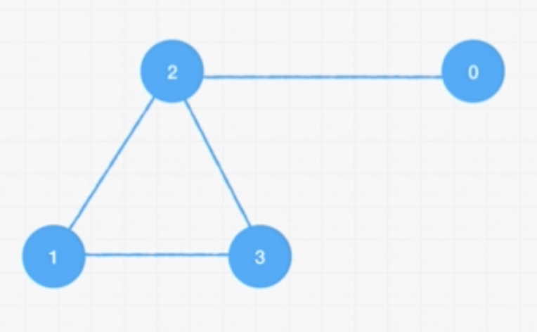

# Graphs 

A set of values that are related in a pair fashion. "Looks like a network".

- `Node/Vertex` are connected by `Edges`
- Useful when it comes to modeling real life
- Ex. represent friendships, networks, roads(one city to another)

- Linked lists are a type of tree, trees are a type of graph

## Characteristics
### Directed
  - "One way street"
  - "Twitter"


### Undirected
  - Think of it as a highway
  - Ex. Facebook

### Weighted Graph
  - Information contained in the edges/connections
  - "Google maps" - What is the shortest path?

### Unweighted

### Cyclic
  - Vertices connected in a circular fashion

### Acyclic
  - Non-circular 


### Example of graph implementation:


// Edge List 
```js
const graph = [[0, 2], [2, 3], [2, 1], [1, 3]];

// Adjacent List 
// Index is the node; values are the neighbors
const graph = [[2], [2, 3], [0, 1, 3], [1, 2]];

// Adjacent Matrix
// Contains 0s and 1s that indicate whether the node x has connection to node y
const graph = [
  [0, 0, 1, 0],
  [0, 0, 1, 1],
  [1, 1, 0, 1],
  [0, 1, 1, 0]
]
```